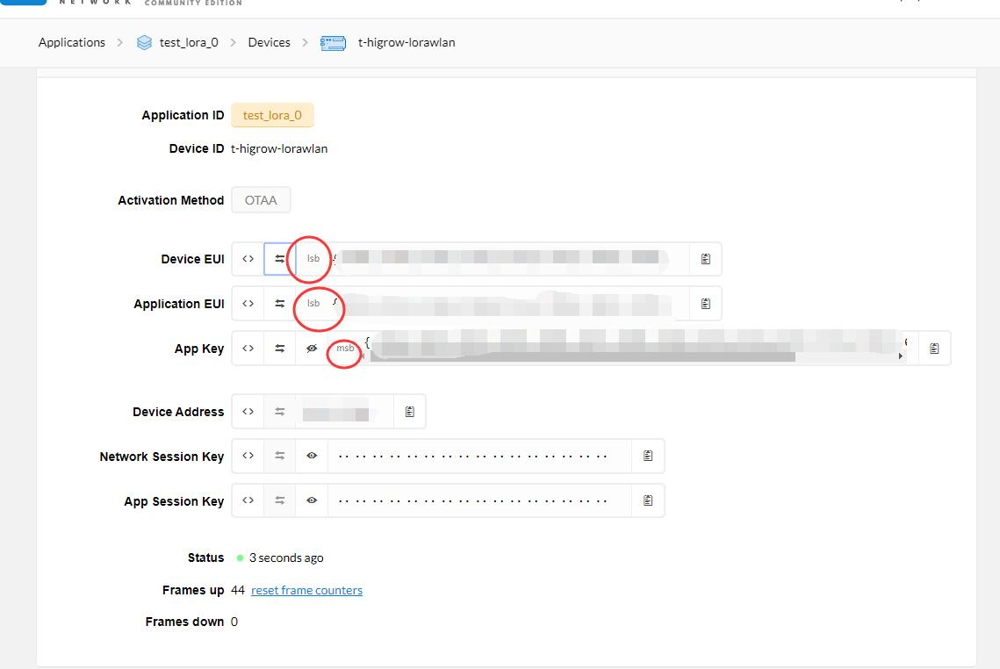
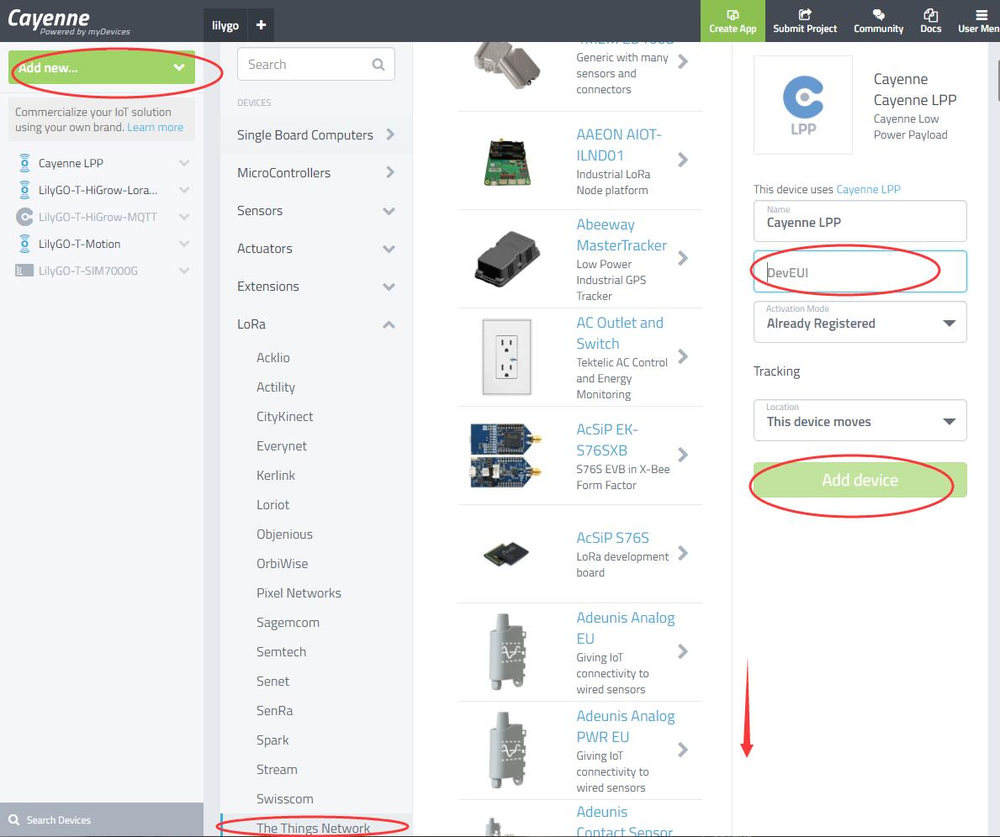
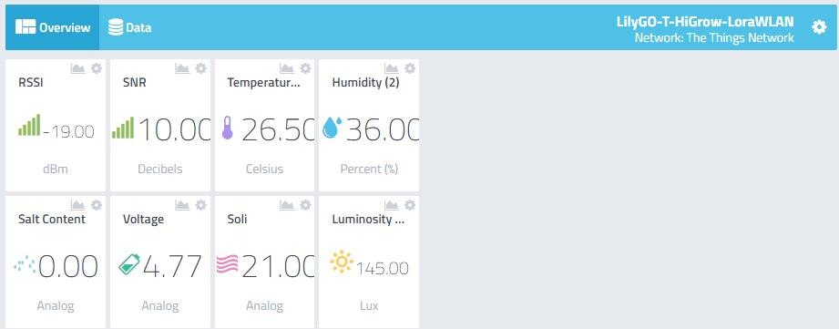

<h1 align = "center">LilyGO T-HiGrow-LoRa-Shield TTN & Cayenne💦 </h1>

 

This example shows how to use **[LilyGO T-HiGrow  + T-HiGrow Lora Sheld ](https://www.aliexpress.com/item/32815782900.html)** to connect to **[TTN](https://www.thethingsnetwork.org/)** and display the data in **[Cayenne](https://cayenne.mydevices.com/)**,The sample code does not do any power optimization, only data demonstration.

# Steps:
1. Move or copy the folders in the libdeps directory to `C:\Documents\Arduino\libraries`
2. Replace APPEUI, DEVEUI, APPKEY in the sketch with the three assigned by **[TTN](https://www.thethingsnetwork.org/)**.

3. Log in to **[Cayenne](https://cayenne.mydevices.com/)**, add the device as shown in the figure below. Select CayenneLPP in the third column, fill in DevEUI in **[TTN](https://www.thethingsnetwork.org/)** in DevEUI in the fourth column, and then add device

4. Finally, if the data is uploaded successfully, the dashboard will automatically add controls.

